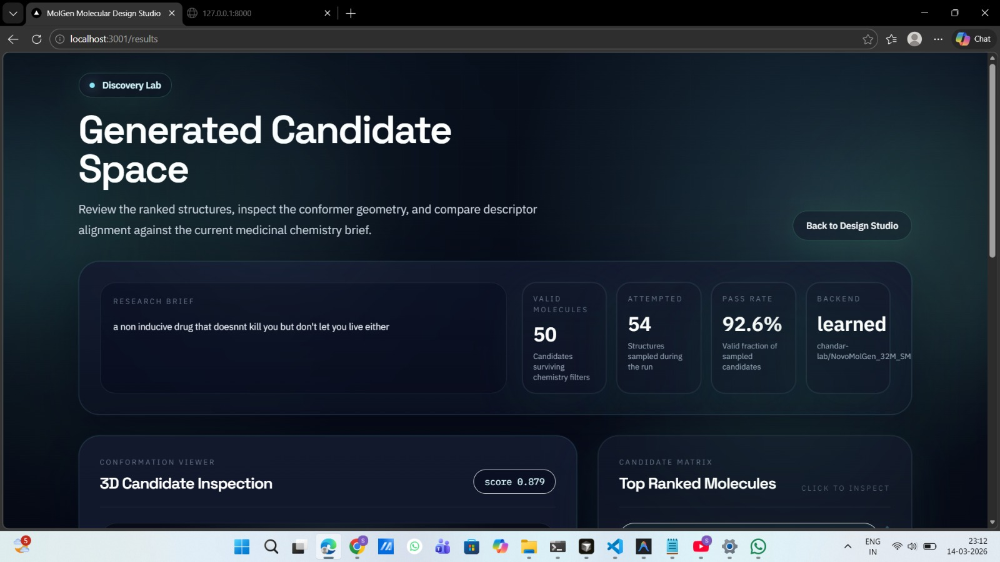
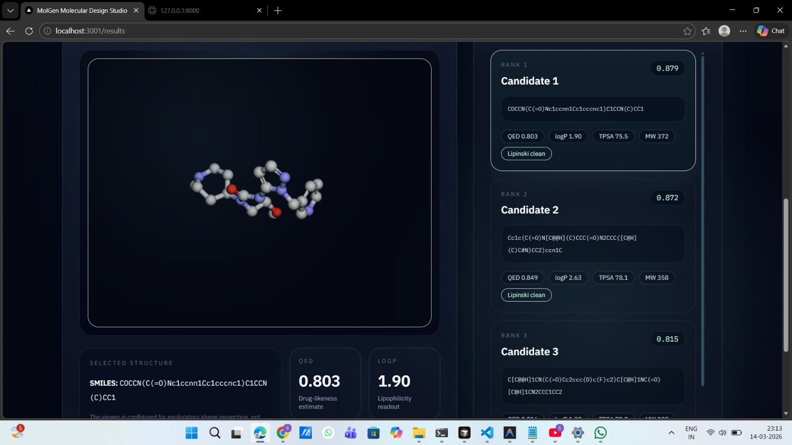
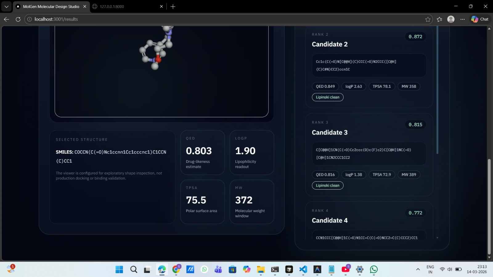

# MolGen 🧬  
### AI-Powered Drug Molecule Generation System  

MolGen is a full-stack application that generates drug-like molecules from natural language prompts, evaluates them, and returns the best candidates in real time.

---

## 🚀 One-Line Pitch  
Describe desired drug properties → get ranked, chemically valid molecules instantly.

---

## 🧠 Why This Matters  
Drug discovery is costly (~$2.6B per drug) and slow (~12 years) with high failure rates.  

MolGen reduces this by:
- Generating candidates computationally  
- Evaluating properties before lab testing  
- Ranking the best molecules automatically  

---

## ⚙️ How It Works  

### 🔁 Pipeline  
Prompt → ML API → Generate Molecules → Score → Rank → Top Results  

---

## 🧩 System Architecture  

| Layer | Component | Description |
|------|----------|-------------|
| Generation | ML API | Generates molecules from prompts |
| Backend | FastAPI | Handles API + scoring |
| Frontend | Next.js | Displays results |
| Database | MongoDB Atlas | Stores generated molecules |

---

## 🔬 Key Features  

- 🔁 Generate-then-filter pipeline  
- 📊 Property scoring (QED, LogP, TPSA)  
- 🧪 RDKit validation  
- 💾 MongoDB storage  
- 🌐 Full-stack deployment  

---

## 📊 Example Output  

| Molecule (SMILES) | QED | Lipinski | TPSA |
|-------------------|-----|----------|------|
| CCOC1=CC=CC=C1 | 0.82 | ✅ | 42.3 |
| CCN(CC)CCO | 0.76 | ✅ | 35.1 |

---

## 🛠 Tech Stack  

- Backend: Python, FastAPI  
- Frontend: Next.js, Tailwind  
- DB: MongoDB Atlas  
- Deployment: Render, Vercel  

---

## 📸 Demo  

### prompt input
<p align="center">
  
</p>

### result
<p align="center">
  
</p>

<p align="center">
  
</p>

---

## ⚙️ Setup  

### Backend
```bash
python -m venv .venv
.\.venv\Scripts\python.exe -m pip install -r backend/requirements.txt
cd backend
..\.venv\Scripts\python.exe -m uvicorn main:app --reload
```

### Frontend
```bash
cd frontend
npm install
npm run dev
```

## 📡 API  

POST `/generate` → returns:
- SMILES  
- QED  
- Lipinski  
- TPSA  

---

## ⚠️ Limitations  

- Computational predictions (not lab-tested)  
- Depends on API/model quality  
 